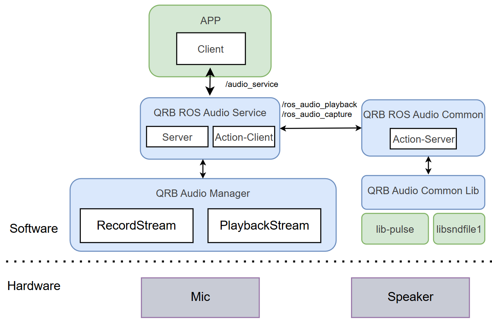

<div align="center">
  <h1>QRB ROS Audio Service</h1>
  <p align="center">
  </p>
  <p>This ROS package delivers essential audio capabilities for playback and recording</p>

  <a href="https://ubuntu.com/download/qualcomm-iot" target="_blank"></a>
  <a href="https://docs.ros.org/en/jazzy/" target="_blank"></a>
 
</div>

---

## 👋 Overview

> 📌 **qrb_ros_audio_service is a ROS package that provides core audio functionalities. It serves as the primary interface for audio playback and recording within the ROS ecosystem.**

<div align="left">
  
</div>

- QRB ROS Audio Service : A ROS node that creates a service server, responds to requests from the application, and translates them into operations on the Audio Manager.
- QRB ROS Audio Common : A ROS node that acts as a bridge between QRB ROS Audio Service and QRB Audio Common Lib.
- QRB Audio Manager : Executes audio operations provided by the Audio Service, based on stream configurations.
- QRB Audio Common Lib : Provides audio functionalities by calling PulseAudio APIs.

## 🔎 Table of Contents

> 📌 If the content is extensive, we recommend adding a table of contents.

  * [APIs](#-apis)
  * [Supported Targets](#-supported-targets)
  * [Installation](#-installation)
  * [Usage](#-usage)
  * [Build from Source](#-build-from-source)
  * [Contributing](#-contributing)
  * [License](#-license)

## ⚓ APIs

> 📌 `qrb_ros_audio_service` APIs

**ROS Interfaces**
<table>
  <tr>
    <th>Interface</th>
    <th>Name</th>
    <th>Type</th>
    <td>Description</td>
  </tr>
  <tr>
    <td>Service</td>
    <td>/audio_service</td>
    <td>qrb_ros_audio_service_msgs::srv::AudioRequest</td>
    <td>Allows ROS applications to send service requests for audio playback and recording.</td>
  </tr>
</table>

> 📌  `qrb_ros_audio_common` APIs

#### ROS parameters
  <table>
    <tr>
      <th>Name</th>
      <th>Type</th>
      <th>Description</th>
      <td>Default Value</td>
    </tr>
    <tr>
      <td>Stream_type</td>
      <td>string</td>
      <td>Specifies the stream type for the action: "playback" for audio playback or "capture" for audio recording.</td>
      <td>default_stream</td>
    </tr>
    <tr>
      <td>action_name</td>
      <td>string</td>
      <td>Specify the name of action</td>
      <td>default_action</td>
    </tr>
    <tr>
      <td>topic_name</td>
      <td>string</td>
      <td>Specify the name of topic</td>
      <td>default_topic</td>
    </tr>
  </table>

**ROS Interfaces**
<table>
  <tr>
    <th>Interface</th>
    <th>Name</th>
    <th>Type</th>
    <td>Description</td>
  </tr>
  <tr>
    <td>Action</td>
    <td>/ros_audio_playback</td>
    <td>qrb_ros_audio_common_msgs::action::AudioCommon</td>
    <td>Action for playback function, specify action name by action_name parameter</td>
  </tr>
  <tr>
    <td>Action</td>
    <td>/ros_audio_capture</td>
    <td>qrb_ros_audio_common_msgs::action::AudioCommon</td>
    <td>Action for record function, specify action name by action_name parameter.</td>
  </tr>
  <tr>
    <td>Subscriber</td>
    <td>/qrb_audiodata</td>
    <td>qrb_ros_audio_common_msgs::msg::AudioData</td>
    <td>Used for streaming audio playback. Subscribes to raw audio data from this node. Can modify the topic name using the --topic_name parameter.</td>
  </tr>
  <tr>
    <td>Publisher</td>
    <td>/qrb_audiodata</td>
    <td>qrb_ros_audio_common_msgs::msg::AudioData</td>
    <td>Used for streaming audio recording. Publishes real-time raw audio data during recording. Can modify the topic name using the --topic_name parameter.</td>
  </tr>
</table>

> 📌  `qrb_audio_common_lib` APIs

<table>
  <tr>
    <th>Function</th>
    <th>Parameters</th>
    <th>Description</th>
  </tr>
  <tr>
    <td>uint32_t audio_stream_open(const audio_stream_info & stream_info, stream_event_callback_func event_callback)</td>
    <td>
      <strong>stream_info</strong>:A structure specifies the configuration of stream.<br>
      <strong>stream_event_callback_func</strong>: callback function.
    </td>
    <td>Open stream, will return stream_handle on succeed.</td>
  </tr>
  <tr>
    <td>int audio_stream_start(uint32_t stream_handle)</td>
    <td><strong>stream_handle</strong>: A unique identifier for steam</td>
    <td>Start stream, return 0 on succeed.</td>
  </tr>
  <tr>
    <td>int audio_stream_mute(uint32_t stream_handle, bool mute)</td>
    <td>
      <strong>stream_handle</strong>: A unique identifier for stream.<br>
      <strong>mute</strong>: Boolean flag indicating whether to mute the stream.
    </td>
    <td>Mute or unmute stream. return 0 on succeed.</td>
  </tr>
  <tr>
    <td>int audio_stream_stop(uint32_t stream_handle)</td>
    <td><strong>stream_handle</strong>: A unique identifier for stream.</td>
    <td>Stop stream, return 0 on succeed</td>
  </tr>
  <tr>
    <td>size_t audio_stream_write(uint32_t stream_handle, size_t length, void * buf)</td>
    <td>
      <strong>stream_handle</strong>: A unique identifier for stream.<br>
      <strong>length</strong>: Size to write.<br>
      <strong>buf</strong>: Point to data buffer.
    </td>
    <td>Write buffer to playback stream, return actually written length.</td>
  </tr>
</table>

## 🎯 Supported Targets

<table >
  <tr>
    <th>Development Hardware</th>
    <th>Hardware Overview</th>
  </tr>
  <tr>
    <td>Qualcomm Dragonwing™ RB3 Gen2</td>
    <th><a href="https://www.qualcomm.com/developer/hardware/rb3-gen-2-development-kit"></a></th>
</table>

---

## ✨ Installation

> [!IMPORTANT]
> **PREREQUISITES**: The following steps need to be run on **Qualcomm Ubuntu** and **ROS Jazzy**.<br>
> Reference [Install Ubuntu on Qualcomm IoT Platforms](https://ubuntu.com/download/qualcomm-iot) and [Install ROS Jazzy](https://docs.ros.org/en/jazzy/index.html) to setup environment. <br>
> For Qualcomm Linux, please check out the [Qualcomm Intelligent Robotics Product SDK](https://docs.qualcomm.com/bundle/publicresource/topics/80-70018-265/introduction_1.html?vproduct=1601111740013072&version=1.4&facet=Qualcomm%20Intelligent%20Robotics%20Product%20(QIRP)%20SDK) documents.

### Add Qualcomm IOT PPA for Ubuntu:

```bash
# Install Qualcomm PPA
sudo add-apt-repository ppa:ubuntu-qcom-iot/qcom-ppa
sudo add-apt-repository ppa:ubuntu-qcom-iot/qirp
sudo apt update
```

### Install Packages

```bash
# Install QRB ROS Audio packages
sudo apt install ros-jazzy-qrb-ros-audio-common ros-jazzy-qrb-ros-audio-service
```

## 🚀 Usage

1. Use this launch file to run this package.
    ```bash
    source /opt/ros/jazzy/setup.sh
    ros2 launch qrb_ros_audio_common component.launch.py
    ```
2. On another ssh terminal.
    ```bash
    source /opt/ros/jazzy/setup.sh
    ros2 launch qrb_ros_audio_service audio_service.launch.py
    ```
3. Run test cases on a third ssh terminal.
 - push music file to device path like /tmp/xxx.wav.
 - download test script.
    ```bash
    wget https://raw.githubusercontent.com/qualcomm-qrb-ros/qrb_ros_audio_service/main/tests/audio_service_test.py
    ```
 - setup ros2 env.
     ```bash
    source /opt/ros/jazzy/setup.sh
    ```
 - Step-by-step playback (sound will output on speaker)
    ```bash
    python3 audio_service_test.py --type='playback' --source='/tmp/xxx.wav' --volume=100
    ```
 - Step-by-step record (will record sound input from mic and save to file)
    ```bash
    python3 audio_service_test.py --type='record' --source='/tmp/rec.wav' --channels=1 --sample_rate=16000 --sample_format=16
    ```
 - Streaming playback
    ```bash
    python3 audio_service_test.py --type='playback' --channels=1 --sample_rate=16000 --sample_format=16 --pub_pcm=True --volume=100 --topic_name='loopback'
    ```
 - Streaming record (if start Streaming playback and Streaming record sound will loopback from mic to speaker)
    ```bash
    python3 audio_service_test.py --type='record' --source='/tmp/rec.wav' --channels=1 --sample_rate=16000 --sample_format=16 --topic_name='loopback'
    ```
---

## 👨‍💻 Build from Source

### Step 1: Install dependencies: 
```bash
# Install build tools and dependencies
sudo add-apt-repository ppa:ubuntu-qcom-iot/qcom-ppa
sudo add-apt-repository ppa:ubuntu-qcom-iot/qirp
sudo apt update
sudo apt install build-essential cmake pkg-config

# Install ROS2 Jazzy (if not already installed)
# Follow instructions at https://docs.ros.org/en/jazzy/Installation.html
sudo apt install ros-jazzy-rclcpp ros-jazzy-rclcpp-components ros-jazzy-ament-cmake-auto ros-jazzy-std-msgs libpulse-dev libsndfile1-dev
```

### Step 2: Clone and Build

```bash
# Navigate to your ROS2 workspace
cd ~/ros2_ws/src

# Clone the repository (if not already cloned)
git clone https://github.com/qualcomm-qrb-ros/qrb_ros_audio_service.git

# Build
cd ~/ros2_ws
colcon build

# Source the workspace
source install/setup.bash
```

## 🤝 Contributing

We love community contributions! Get started by reading our [CONTRIBUTING.md](CONTRIBUTING.md).  
Feel free to create an issue for bug reports, feature requests, or any discussion 💡.

## 📜 License

Project is licensed under the [BSD-3-clause License](https://spdx.org/licenses/BSD-3-Clause.html). See [LICENSE](./LICENSE) for the full license text.
